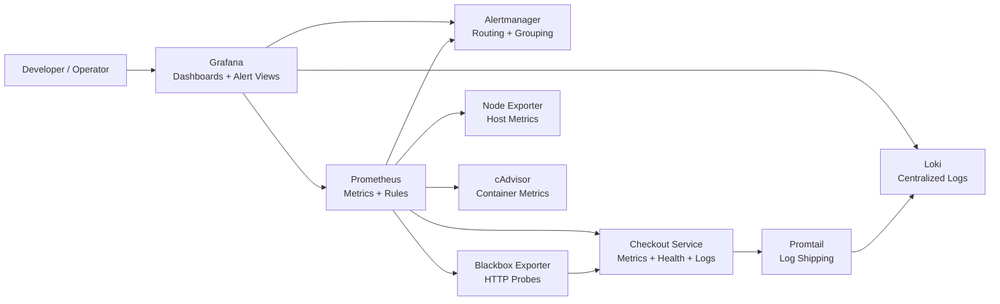

# Monitoring & Observability with Prometheus and Grafana

A production-oriented monitoring project for a containerized Node.js checkout service. The stack includes Prometheus, Grafana, Alertmanager, Loki, Promtail, Node Exporter, cAdvisor, and Blackbox Exporter, all orchestrated with Docker Compose and designed to demonstrate real-world observability workflows for portfolios, internships, and resume projects.

## What this project demonstrates

- Application-level metrics for request volume, latency, errors, active users, active sessions, CPU, memory, uptime, and business events
- Health checks with separate liveness and readiness endpoints
- Infrastructure monitoring for the Docker host and individual containers
- Availability probing with HTTP uptime checks
- Centralized structured logging with Loki and Promtail
- Alerting for downtime, high CPU, high memory, elevated error rates, and slow APIs
- Auto-provisioned Grafana dashboards and datasources
- A practical debugging workflow that connects metrics, probes, logs, and alerts

## Architecture Diagram

The source for the diagram is in [docs/architecture.mmd](/D:/Monitoring-Observability-Setup/docs/architecture.mmd).



## Stack Components

| Service | Purpose | Port |
| --- | --- | --- |
| `app` | Sample checkout API with metrics, health checks, and structured logs | `3000` |
| `prometheus` | Scrapes metrics, evaluates rules, and exposes alert state | `9090` |
| `grafana` | Dashboards, alert views, and log exploration | `3001` |
| `alertmanager` | Alert grouping and routing | `9093` |
| `loki` | Centralized log storage | `3100` |
| `promtail` | Ships application logs to Loki | `9080` internally |
| `node-exporter` | Host/system metrics | `9100` |
| `cadvisor` | Container CPU, memory, filesystem, and runtime metrics | `8080` |
| `blackbox-exporter` | HTTP uptime probes for `/health/live` and `/health/ready` | `9115` |

## Project Structure

```text
.
|-- app/
|   |-- Dockerfile
|   |-- package.json
|   `-- src/
|-- docs/
|   |-- architecture.mmd
|   |-- observability-playbook.md
|   `-- troubleshooting.md
|-- monitoring/
|   |-- alertmanager/
|   |-- grafana/
|   |-- loki/
|   |-- prometheus/
|   `-- promtail/
|-- scripts/
|   `-- load-test.js
|-- docker-compose.yml
`-- README.md
```

## Quick Start

### Prerequisites

- Docker Desktop or Docker Engine with Compose support
- Linux containers enabled if you are using Docker Desktop on Windows/macOS
- Node.js 20+ only if you want to run the optional local load test script

### Start Everything

1. Optionally copy the environment template:

   ```powershell
   Copy-Item .env.example .env
   ```

2. Start the full stack with a single command:

   ```powershell
   docker compose up --build -d
   ```

3. Open the services:

- Application: [http://localhost:3000](http://localhost:3000)
- Prometheus: [http://localhost:9090](http://localhost:9090)
- Grafana: [http://localhost:3001](http://localhost:3001)
- Alertmanager: [http://localhost:9093](http://localhost:9093)

### Default Grafana Credentials

- Username: `admin`
- Password: `admin123`

## Application Endpoints

| Endpoint | Purpose |
| --- | --- |
| `/` | Service overview |
| `/metrics` | Prometheus metrics endpoint |
| `/health/live` | Liveness endpoint |
| `/health/ready` | Readiness endpoint |
| `/api/catalog` | Sample read-heavy API |
| `/api/checkout` | Sample write path with realistic latency and synthetic failures |
| `/api/error` | Intentional 500 endpoint for alert testing |
| `/api/sessions` | Active user/session snapshot |

## Metrics Collected

### Application metrics

- `http_requests_total`
- `http_errors_total`
- `http_request_duration_seconds`
- `app_active_users`
- `app_active_sessions`
- `app_readiness_status`
- `app_process_cpu_usage_percent`
- `app_process_memory_usage_bytes`
- `app_uptime_seconds`
- `app_business_events_total`
- `app_log_events_total`

### Infrastructure and platform metrics

- Host CPU, memory, uptime, and filesystem metrics from Node Exporter
- Container CPU and memory metrics from cAdvisor
- Uptime and probe duration metrics from Blackbox Exporter
- Prometheus, Loki, and Alertmanager self-metrics

## Prometheus Monitoring Coverage

- Application scraping on `/metrics`
- Container metrics via cAdvisor
- Host/system metrics via Node Exporter
- Endpoint availability via Blackbox Exporter
- Alert rule evaluation with Alertmanager integration

The key configs live here:

- [docker-compose.yml](/D:/Monitoring-Observability-Setup/docker-compose.yml)
- [monitoring/prometheus/prometheus.yml](/D:/Monitoring-Observability-Setup/monitoring/prometheus/prometheus.yml)
- [monitoring/prometheus/alerts.yml](/D:/Monitoring-Observability-Setup/monitoring/prometheus/alerts.yml)
- [monitoring/alertmanager/alertmanager.yml](/D:/Monitoring-Observability-Setup/monitoring/alertmanager/alertmanager.yml)

## Alert Rules Included

- `ServiceDown`
- `ReadinessProbeFailing`
- `HighApplicationErrorRate`
- `HighApplicationLatencyP95`
- `AppProcessHighCPUUsage`
- `HostHighCPUUsage`
- `HostHighMemoryUsage`
- `ContainerHighMemoryUsage`

## Grafana Dashboards

### 1. Application Overview

File: [monitoring/grafana/dashboards/application-overview.json](/D:/Monitoring-Observability-Setup/monitoring/grafana/dashboards/application-overview.json)

- First row shows high-signal SLIs: throughput, error rate, p95 latency, and user/session activity
- Middle row shows traffic shape and latency quantiles
- Bottom row focuses on route-level errors, user trends, business events, and availability
- Variables allow filtering by application instance and route

### 2. Infrastructure Overview

File: [monitoring/grafana/dashboards/infrastructure-overview.json](/D:/Monitoring-Observability-Setup/monitoring/grafana/dashboards/infrastructure-overview.json)

- Tracks host CPU, host memory, host uptime, and endpoint health
- Visualizes container CPU and memory usage by Compose service
- Shows blackbox probe success and duration for uptime monitoring
- Includes a scrape health matrix for fast target troubleshooting

### 3. Logs & Reliability

File: [monitoring/grafana/dashboards/logs-reliability.json](/D:/Monitoring-Observability-Setup/monitoring/grafana/dashboards/logs-reliability.json)

- Displays centralized application logs from Loki
- Shows log volume by level, error-log rate, active alerts, and probe latency
- Makes it easy to pivot from a firing alert into the corresponding request logs

## Screenshot / Demo Walkthrough

If you want screenshots for a portfolio or README gallery, use this sequence:

1. Start the stack and wait for all Prometheus targets to turn `UP`.
2. Run the load test for 60-120 seconds so latency, throughput, and error panels become interesting.
3. Capture `Application Overview` after load begins. This is the best screenshot for showing request rate, p95 latency, active sessions, and route-level traffic.
4. Capture `Infrastructure Overview` during the same window to show container CPU/memory utilization and endpoint uptime.
5. Capture `Logs & Reliability` after calling `/api/error` a few times so logs and active alerts are both visible.

These screenshots tell a stronger story than static empty dashboards because they show how traffic, failures, and logs correlate in real time.

## Centralized Logging Setup

- The application writes structured JSON logs to stdout and to a shared log volume
- Promtail tails the application log file and forwards entries to Loki
- Loki is provisioned as a Grafana datasource for log search and timeline exploration
- Log labels such as `level`, `route`, `method`, and `statusCode` are extracted for filtering

## Load Testing

Run the included script locally after the containers are up:

```powershell
node .\scripts\load-test.js
```

Useful overrides:

```powershell
$env:TARGET_URL="http://localhost:3000"
$env:LOAD_TEST_CONCURRENCY="12"
$env:LOAD_TEST_DURATION_SECONDS="90"
node .\scripts\load-test.js
```

What it does:

- Generates mixed `catalog`, `checkout`, and synthetic error traffic
- Simulates multiple users and sessions
- Produces enough load to light up the latency, throughput, error, and active-user panels

## How Monitoring Improves Debugging and Reliability

This project is intentionally built around a realistic failure story:

- Prometheus detects rising latency, request failures, or resource pressure
- Blackbox probes show whether health endpoints are still reachable from an availability perspective
- Grafana dashboards narrow the problem to a route, dependency pattern, or infrastructure bottleneck
- Loki logs explain the failing request path and affected users
- Alertmanager surfaces the incident quickly so engineers respond sooner

See the step-by-step operator workflow in [docs/observability-playbook.md](/D:/Monitoring-Observability-Setup/docs/observability-playbook.md).

## Production-Oriented Practices Used

- Clear separation of application, monitoring, dashboard, and documentation assets
- Version-controlled dashboard JSON and provisioning files
- Explicit resource limits for the demo app container
- Readiness and liveness checks separated for safer rollout behavior
- Structured logs and label extraction for faster debugging
- Alert thresholds based on user-facing symptoms and capacity signals
- Compose volumes for persistent Grafana, Prometheus, Loki, Alertmanager, and application logs

## Troubleshooting

Common startup and data-collection issues are documented in [docs/troubleshooting.md](/D:/Monitoring-Observability-Setup/docs/troubleshooting.md).

## Cleanup

```powershell
docker compose down -v
```

## Resume / Portfolio Talking Points

- Built a complete observability stack for a containerized service using Prometheus, Grafana, Loki, Alertmanager, Node Exporter, cAdvisor, and Blackbox Exporter
- Instrumented a web application with custom Prometheus metrics, structured logs, and health probes
- Designed dashboards for performance, reliability, infrastructure health, and incident debugging
- Added alerting for downtime, error spikes, latency regression, and resource saturation
- Demonstrated end-to-end troubleshooting using metrics, logs, and probes in a Docker-based environment
